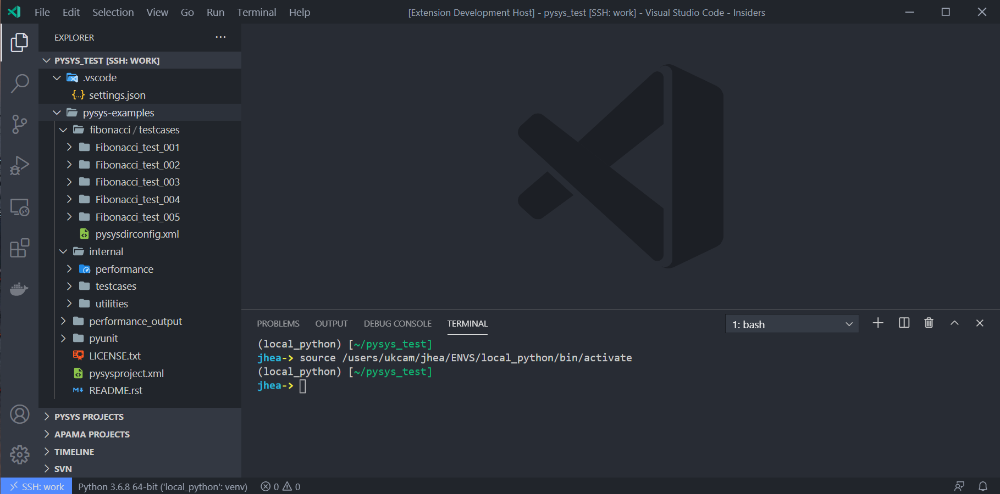
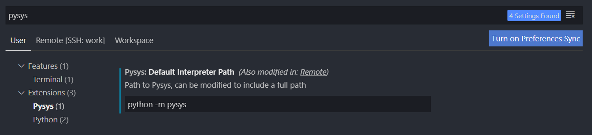
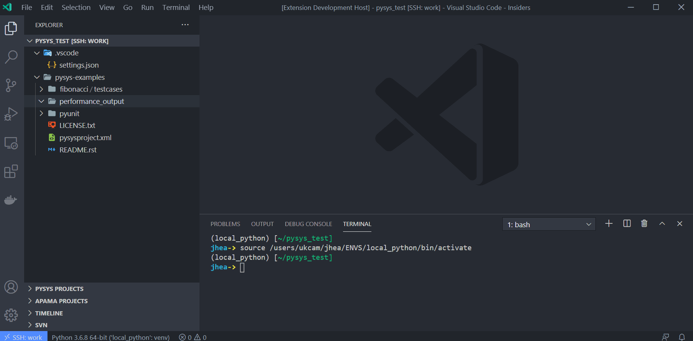
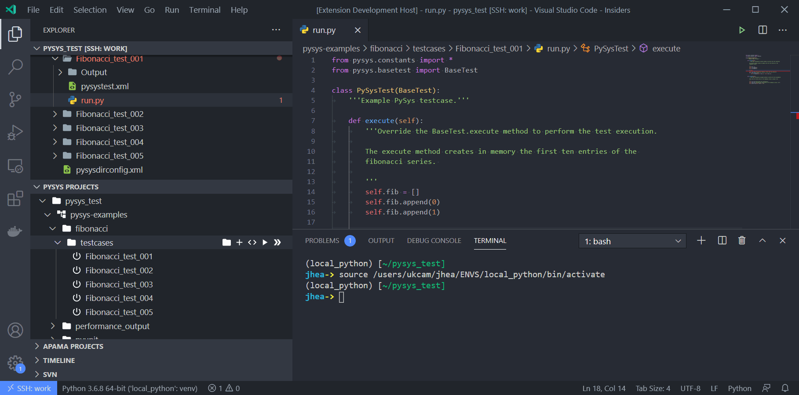
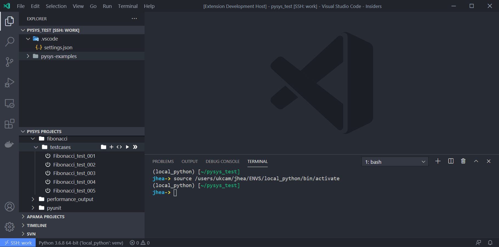
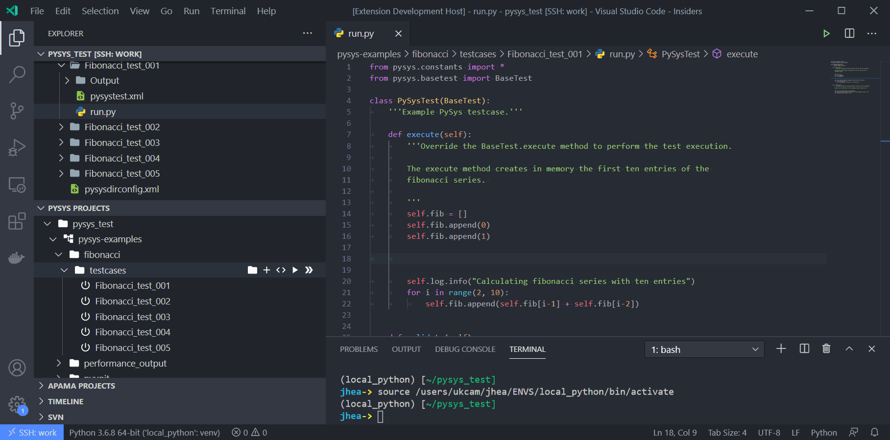
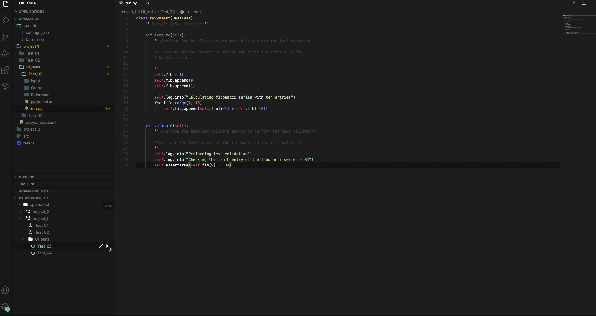
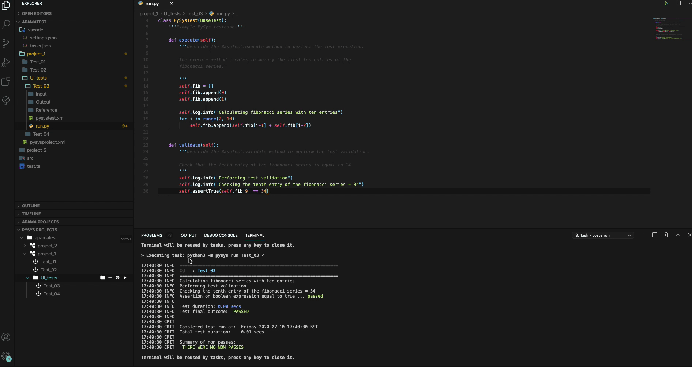

# pysys-vscode-extension
This is a vscode extension for the pysys framwork it enables the use of this testing framework in Visual Studio Code allowing the use of the UI to interact with and create tests for your software projects.

for more information on pysys please visit the [pysys project page](https://pypi.org/project/PySys/)

## Features

* See your pysys project structure at a quick glance
* Create and run tests straight from the UI
* Set custom arguments to run your tests with
* Test failures displayed in the vscode problems tab

## Requirements

Python and the pysys extension are required to use this extension.

## Settings

* **Pysys Interpreter :** the default pysys interpreter the application will use.

***

## Pysys view

A view in the vscode explorer that displays all pysys projects/tests in the current workspace(s).

You can create new projects, directories or tests straight from the view.

## Edit

Start working on your tests straight away

Fully integrated python extension from Microsoft allows auto complete.

## Run

Run projects, directories or individual tests with default settings.

Or set your own settings for running projects or directories, such as setting custom run arguments.

