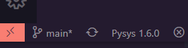
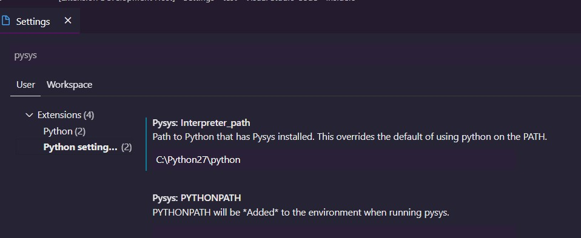
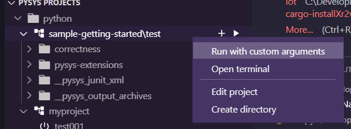
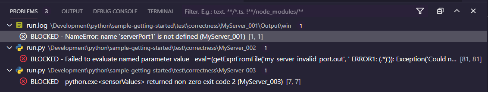
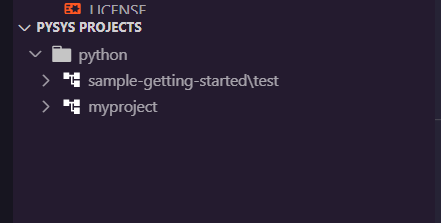
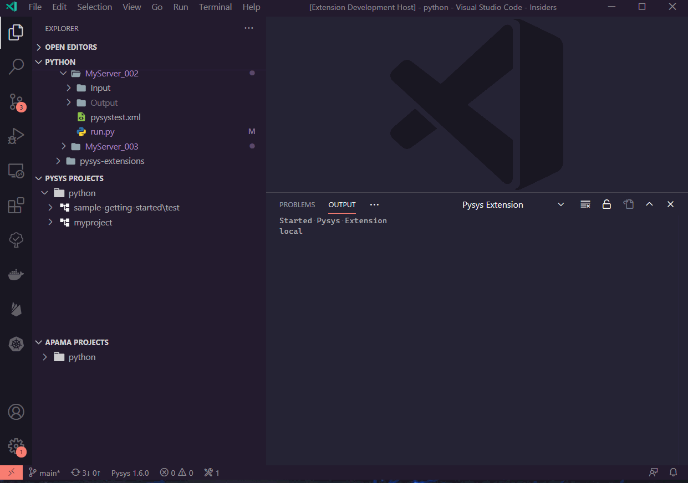

# pysys-vscode-extension

CI takes place on the Azure Platform building on Linux, Windows and Mac platforms.

## Requirements

Python and the PySys framework are required to use this extension.

By default the extension will use the python and PySys that are currently on the path. The status bar will show the version of PySys found.

However the python interpreter can be set using the interpreter_path setting

___The extension will not load if python or PySys are not detected.___

This extension allows you to run PySys tests in the VSCode UI.

For more information about PySys please visit the [PySys project page](https://pysys-test.github.io/pysys-test/)

* See your PySys project structure at a quick glance
* Create and run tests directly from the UI
* Set custom arguments with which to run your tests

* From PySys 1.6 Test failures are displayed in the vscode problems tab

* show the tests as a flat structure or in tree form

# Features

## PySys view

A view in the vscode explorer that displays all PySys projects/tests in the current workspace(s).

You can create new projects, directories or tests straight from the view.

## Edit

Start working on your tests straight away

Fully integrated python extension from Microsoft allows auto-complete.

## Run

Run projects, directories or individual tests with default settings.

Or set your own settings for running projects or directories, such as setting custom run arguments.

Finally if you use PySys 1.6+ the output of your runs will be automatically shown in the problems tab of vscode. These problems can then be used to navigate to the source of the error.

## Release Notes

## v0.8.1

First release under ApamaCommunity.
